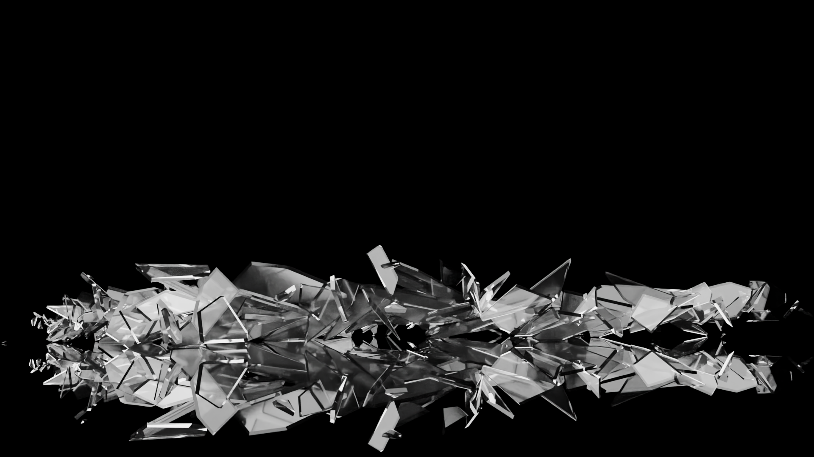

Here is a README template for your glass smash effect in Blender:

---

# Glass Smash Effect in Blender

This repository contains a Blender project showcasing a glass smash effect created using rigid body dynamics. The effect is designed to simulate realistic glass breaking upon impact, suitable for use in animations, visual effects, and games.

[)](https://www.instagram.com/reel/C4IJdpiPug3/?utm_source=ig_web_copy_link&igsh=MzRlODBiNWFlZA==)

## Description

The glass smash effect demonstrates the use of Blender's rigid body dynamics to create a realistic shattering effect. The project includes a glass object that breaks into multiple pieces upon collision with another object.

### Features

- Realistic glass shattering effect
- Use of Blender's rigid body dynamics
- High-resolution textures and materials
- Suitable for animations and visual effects
